# 16-180 Concepts of Robotics

Welcome to Concepts of Robotics.  We will be working with the Mujoco simulator---a popular simulator used in Robotics and AI research. This repository includes the initial software setup you'll need for this class. We will be using a Git-based workflow. You will clone a main "Course Shell" folder, and then clone individual assignments into that folder as the semester progresses.

**Supported OS:** Windows 10/11, macOS (Intel/Apple Silicon), Ubuntu Linux.


## Step 1: Install Visual Studio Code (VS Code)

1. Download and install from https://code.visualstudio.com/.
    * **macOS**
        1. Download VS code <br/> [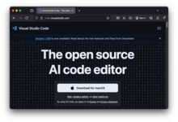](screenshots/macos_vs_001_download_vs_code.png)
        2. Open the downloaded file it should extract a file called "Visual Studio Code" <br/> [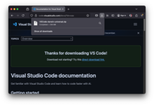](screenshots/macos_vs_002_download_zip.png) 
        3. Find that file and drag it to the "Applications" folder (usually on the left side bard) <br/> [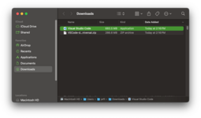](screenshots/macos_vs_003_downloads_folder.png)
    (screenshots/macos_vs_003_downloads_folder.png)
    * **Windows**
        1. Download VS code from Microsoft Store
        <br/> [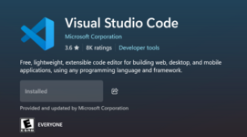](screenshots/windows_vs_001_store.png)

2. Open VS Code.
    * **macOS:**
        1. In the applications folder, double-click to open Visual Studio Code <br/> [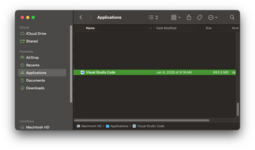](screenshots/macos_vs_004_applications_folder.png)
        2. If prompted about it being downloaded from the internet, click "Open" <br/> [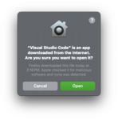](screenshots/macos_vs_005_download_from_internet.png)
        3. If asked "Allow Electron to find devices?", click **Allow.**
    click **Allow.**
    * **Windows**
        1. Go to Start > Search VS Code > Click to open Visual Studio Code
        <br/> [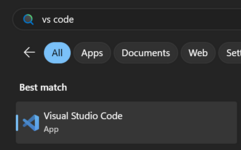](screenshots/windows_vs_001_search.png)

3. Install the Python extension (by Microsoft) via the Extensions tab on the left. (It may already be installed)
    * Click on the icon on the left with four boxes to open the extensions panel <br/> [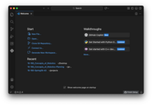](screenshots/macos_vs_005_download_from_internet.png)
    * Type "Python" in the search bar, and select the "Python (by Microsoft)" extension. Ensure that it is installed. <br/> [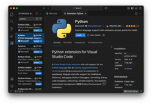](screenshots/macos_vs_007_python_extension.png)


## Step 2: Install Git

You need Git to download course materials and submit assignments.

* **Windows:** Download "Git for Windows" from https://git-scm.com.
    * During install, accept all default options.
* **macOS:** Follow the instructions here: https://git-scm.com/install/mac
* **Linux:** `sudo apt update && sudo apt install git`

## Step 3: Install Python

We recommend **Python 3.11**. (Important: we have only tested on 3.11. It may work on 3.10 or 3.12. It was reported to NOT work on 3.14.)

* **Windows:** 
    * Download python 3.13 from Microsoft Store
        <br/> [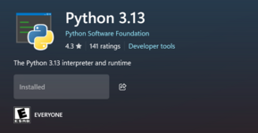](screenshots/windows_python_002_store.png)
* **macOS:**
    * Option 1: Download the universal installer from https://python.org, or use this direct link: [download python 11](https://www.python.org/ftp/python/3.11.7/python-3.11.7-macos11.pkg). Once downloaded, double click it, and click through the prompts until it is installed.
    * Option 2: If you have Homebrew, use `brew install python@3.11.`
    * Option 3: If you have MacPorts, use `sudo port install python311`

## Step 4: Clone the This Repo

This will create your main folder for the semester. Using Git from VSCode.

1. Open VS Code.
2. Click on the "Clone Git Repository..." link to see the text field that says "Provide repository URL or pick a repository source." <br/> [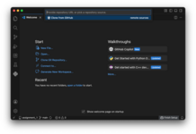](screenshots/macos_clone_001_url_entry.png)
3. Where it asks "Provide repositry URL or pick a repository source." Copy and paste this URL: `https://github.com/cmu-16-180/16-180_Concepts_of_Robotics.git` <br/>
[](screenshots/macos_clone_002_repo_url.png)
4. It will pop open a directory selector. Navigate to where you want the class folder (e.g., Documents) and click "Select as Repository Destination". This will create a folder called `16-180_Concepts_of_Robotics` under the directory you select (e.g., `Documents/16-180_Concepts_of_Robotics`). <br/> [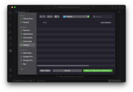](screenshots/macos_clone_003_parent_folder.png)
5. Wait for the download to finish. A popup will appear at the bottom right asking "Would you like to open the cloned repository?" **Click "Open".** <br/> [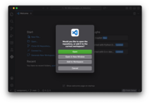](screenshots/macos_clone_004_open_workspace.png)
6. If it asks "Do you trust the authors of the files in this folder?" <br/> [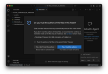](screenshots/macos_clone_005_trust_prompt.png)
    * Leave the checkbox next **unchecked** to "Trust the authors of all files in this parent folder ..." (You can check the box if you want, but it's not necessary for this class.
    * **Click the button "Yes, I trust the authors"**
7. If it asks, "The extension 'GitHub Copilot Chat' wants to sign in using GitHub'." You can cancel or allow to your preference (if you don't know, choose "Cancel")
8. You should now see the opened workspace. We recommend you close the "Build with Agent" tab as it takes up a lot of screen space. <br/> [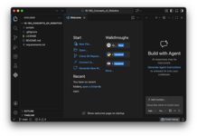](screenshots/macos_clone_006_opened_workspace.png) [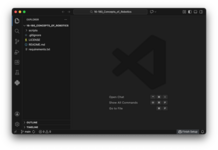](screenshots/macos_clone_007_workspace.png)


## Step 5: Python Virtual Environment

We will create one virtual environment for the entire semester. A virtual environment includes all the software (e.g. the Mujoco Simulator) you will need for the class.

1. Open VS Code Terminal from the menu: `Terminal > New Terminal` (ensure you are inside `16-180_Concepts_of_Robotics` workspace) <br/> [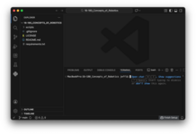](screenshots/macos_venv_001_open_terminal.png)
2. Create the virtual environment (aka "venv") by typing into the terminal:
    * **Windows:** `python -m venv venv` <br/> [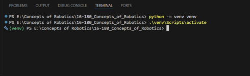](screenshots/windows_vs_001_env.png)
    * **Mac/Linux:** `python3 -m venv venv` <br/> [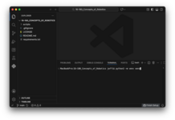](screenshots/macos_venv_002_create_venv.png)
2. Activate it:
    * If VS Code asks "We noticed a new environment...," click **Yes.**
    * Check your terminal prompt. It should start with `(venv)`.
    * *If not active:*
        * **Windows:** `.\venv\Scripts\activate`
        * **Mac/Linux:** `source venv/bin/activate` <br/> [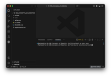](screenshots/macos_venv_003_activate.png)
3. Verify that the virtual environment is activated (you should now see `(venv)` before the terminal prompt) <br/> [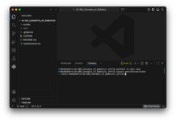](screenshots/macos_venv_004_activated.png)
4. Upgrade the python package manager "pip" ("pip" means "pip installs packages") by running the command `pip install --upgrade pip` <br/> [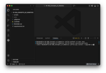](screenshots/macos_venv_005_upgrade_pip.png)
5. Install the packages we will be using for this course by running the command `pip install -r requirements.txt` <br/> [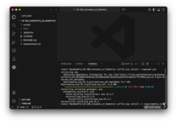](screenshots/macos_venv_006_install_requirements.png)

## Step 6: Verify Installation

Run the verification script included in the shell.
* **Windows/Linux:** `python .\scripts\check_setup.py`
* **macOS:** `mjpython scripts/check_setup.py` (if you use `python` here, instead of `mjpython` you will get a somewhat informative message telling you to use `mjpython instead.) <br/> [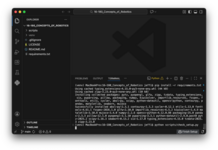](screenshots/macos_check_001_wrong_python.png) [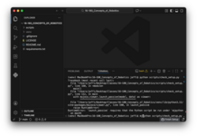](screenshots/macos_check_002_mjpython.png)

*Success Criteria:* A simulation window appears with a crude robot arm and a lot of boxes.

[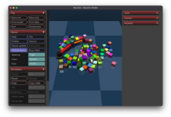](screenshots/macos_check_003_mujoco.png)

## Step 7: Install the Robot Zoo (Menagerie)

We need the "Unitree Go1" and "Shadow Hand" robot model for the next demos. The Google/Deepmind "Menagerie" library includes over 2GB of real-world robot models. We have provided a script that downloads only the robots we need (saving a LOT of space).

Run the following command in your terminal (ensure you are still in the `16-180_Concepts_of_Robotics` folder):
```
python scripts/setup_menagerie.py
```
[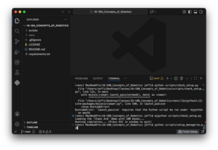](screenshots/macos_zoo_001_install.png)

If successful, you should see some messages go by following the progress of the download.

[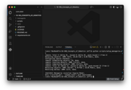](screenshots/macos_zoo_002_installed.png)

## Step 8: Run the Unitree Go1 and Shadow Hand Demos

Now that the Menagerie is installed, run the `zoo_keeper.py` script included in the course shell to see a high-fidelity simulations based on **real robots**. Much of modern robotics research uses these models and simulators to get robots to do useful things.

**No more screenshots here! Good luck, and enjoy the robot demos!**

### Demo 1: Zoo Keeper Demo:
In this demo, you'll see a quadruped robot amble about. The script applies a period motion to the leg joints to form a gait. The simple gait allows the robot to move around---but obviously, it could much better. We will discuss some of the latest research in enabling better motions.

* **Windows/Linux:** `python .\scripts\zoo_keeper.py`
* **macOS:** `mjpython scripts/zoo_keeper.py`

### Demo 2: Rock-Paper-Scissors Demo:
In the next demo, you'll see a dexterous robot hand known as the "Shadow Hand" perform rock-paper-scissors. You can interact with this demo by telling the robot to change between the different poses using your keyboard (the script provides instructions on how to change pose). Try flipping it between different poses quickly.

* **Windows/Linux:** `python .\scripts\rps.py`
* **macOS:** `mjpython scripts/rps.py`


**Interaction Guide:**

1.  **Visuals:** You should see a robot dog marching in place.
2.  **Interaction:**
    *   **Double-click** the robot's silver torso to select it (it will highlight).
    *   **Apply Force:**
        *   **Windows/Linux:** Hold **CTRL + Right Click** and drag.
        *   **macOS:** Hold **Command (⌘) + Left Click** and drag (or Control + Two-finger click).
    *   You can shove the robot to test its stability!

### Next Steps

You are now fully set up for the semester! Please wait for the announcement regarding **Assignment 1**, which will include instructions on how to download the assignment code into this folder.


